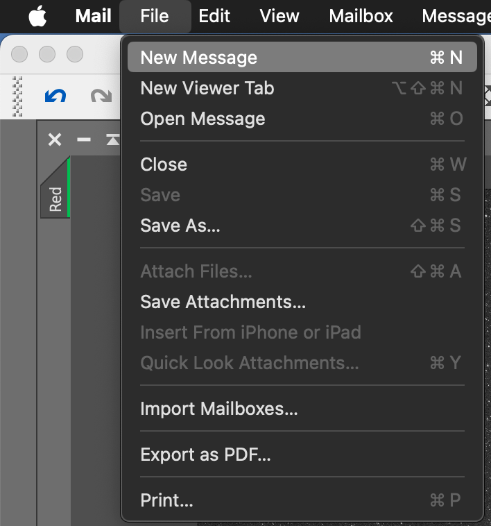
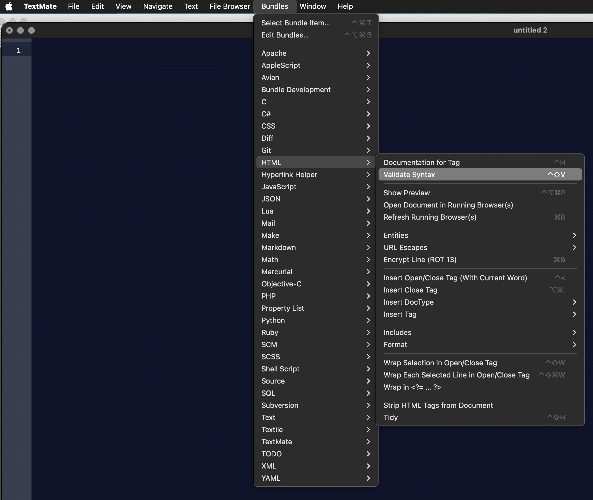

# streamdeck-macmenulib

## Description

`MacOS Menu Lib` is a plugin that allows you to trigger arbitrary menu items on
MacOS It's heavily based on Gabriel Perales's 
[streamdeck-osascript](https://github.com/gabrielperales/streamdeck-osascript), which
in turn was based on the plugin `streamdeck-applescript`

The format of the menu items is currently: `"App Name", "Menu1", "Menu1 Submenu", "Actual Item"` (see below for examples)
The first entry is the application name, the following values are the subsequent menu and sub menus

## Features

- code written in Objective-C
- macOS only
- executes / triggers arbitrary menu items

## Installation

In the Release folder, you can find the file
`com.theastroshed.macmenuutil.streamDeckPlugin`. If you double-click this file
on your machine, Stream Deck will install the plugin.

## But it doesn't work!

I can't get it to refresh / change the params when loading. The workaround is to copy 
the activity, paste it somewhere else, then move it where you want it. PRs welcome!

## Source code

The Sources folder contains the source code of the plugin. Don't judge, I hacked this together.


## Examples

### Create a new message in apple mail

```
"Mail", "File", "New Message"
```

### Validate HTML syntax in textmate


```
"TextMate", "Bundles", "HTML", "Validate Syntax"
```
(yes, I know there's a keyboard shortcut but I wanted something nested)

Some icons are taken from [Icons8](https://icons8.com) and existing streamdeck icons
